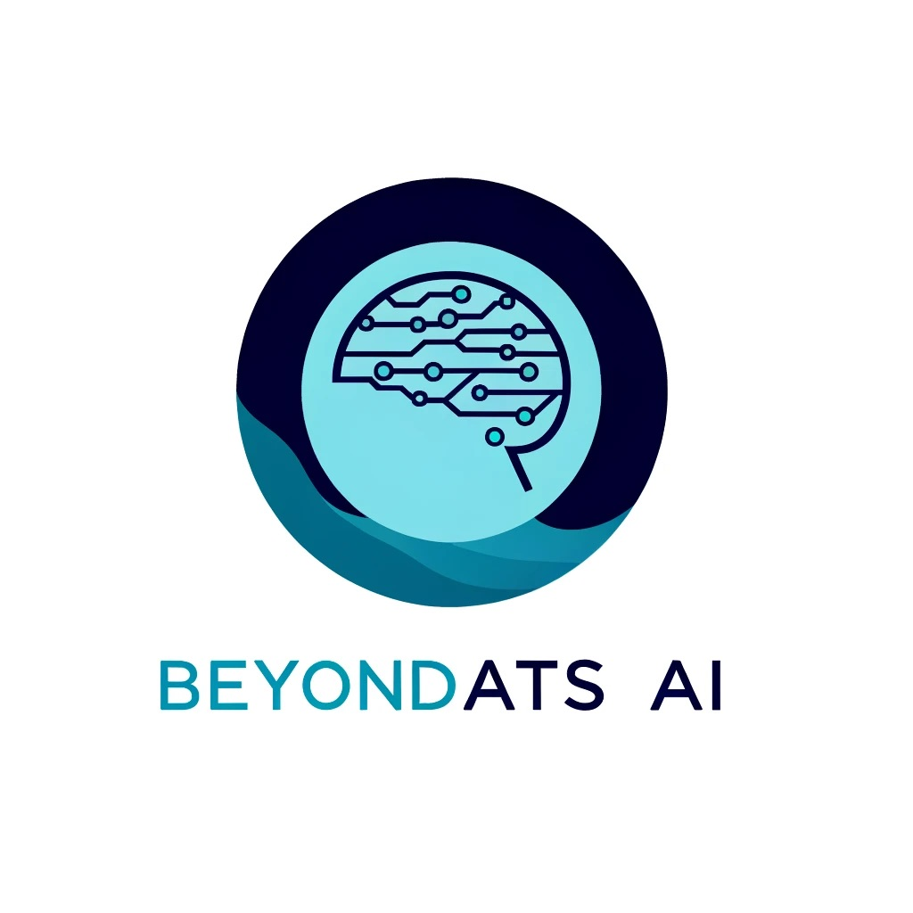
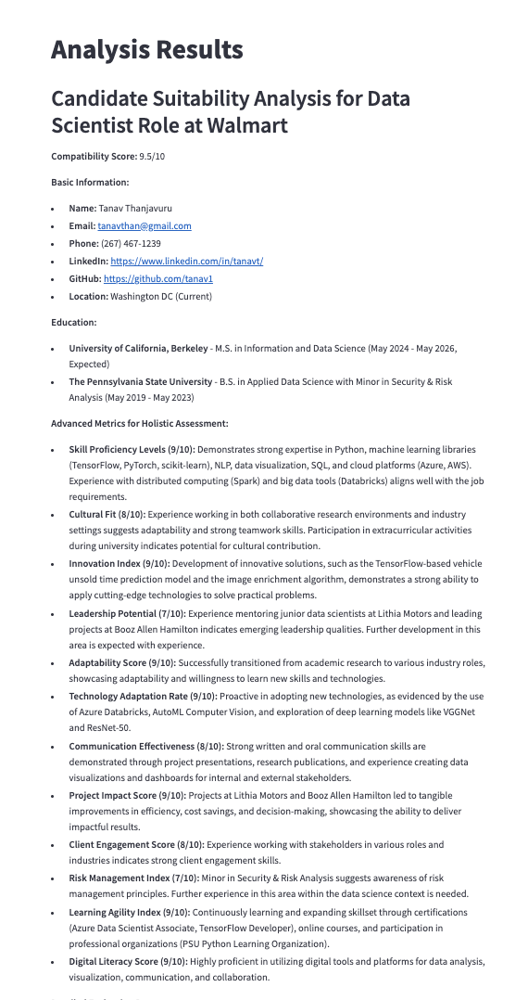
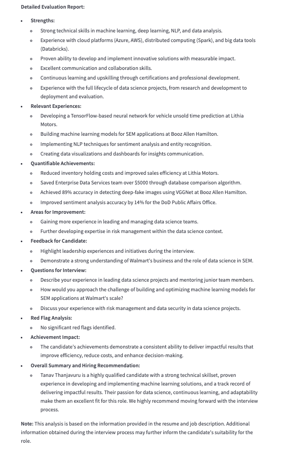

<p align="center">
  
</p>

# BeyondATS AI

BeyondATS AI is an advanced resume analysis tool designed to overcome the limitations of traditional Applicant Tracking Systems (ATS). By incorporating cutting-edge AI technologies, BeyondATS AI ensures a more holistic and fair assessment of candidates' resumes, enhancing recruitment processes and enabling better candidate selection.

**Try it yourself:**

https://beyondats-ai.streamlit.app/


## Motivation: 
### Case Study: The Impact of Inaccurate Resumes on Hiring Processes:

As part of a social experiment, a social media influencer submitted a resume containing false information about their work experience. The resume listed positions at renowned companies such as Google, Instagram, and Amazon, alongside peculiar job responsibilities:

- "Enhanced a 300% increase in average coffee break time of team, by nonstop crying in the main office room."

- "Verified sending threats to 16 competitors, decreasing the competitive landscape by 18%."

- "Helped utilize Google's computing resources to mine $15M of Ethereum before getting caught & returning it."

These are only a few of the odd job responsibilities listed. Additionally, the candidate claimed to have worked on the non-existent "Amazon Dating" team. Despite the incredulous claims, the resume garnered interviews from reputable companies including Databricks, MongoDB, Reddit, Lucid, Cloudflare, and Robinhood.

This incident underscores the challenges faced by companies in vetting candidates amidst the sheer volume of applications received. Automated applicant tracking systems (ATS) and time-pressed hiring managers often overlook inconsistencies or inaccuracies in resumes, leading to the inadvertent consideration of unqualified candidates. Additionaly, talented candidates who are qualified for a role are getting overlooked because their resume is not ATS friendly. 

To address this issue, companies are increasingly turning to AI-driven solutions to enhance their hiring processes. By utilizing machine learning algorithms, organizations can efficiently screen resumes for both qualifications and integrity, mitigating the risk of hiring based on false information.

This case highlights the importance of thorough resume vetting and the potential for AI to streamline recruitment practices, ensuring that deserving candidates receive fair consideration while maintaining the integrity of the hiring process.

More Information:

https://www.linkedin.com/posts/jehakjerrylee_kismma-d-nhuhts-series-activity-7184308527132241921-76m5/

https://twitter.com/JerryJHLee/status/1778484920593055763

https://www.reddit.com/r/jobs/comments/1c1zw83/i_applied_to_100_jobs_using_a_resume_with_the/

## Features:

- **Comprehensive Analysis**: Uses AI to perform deep analysis of resumes, assessing not just technical qualifications but also soft skills and cultural fit.
- **Holistic Analysis** The tool will analyze and assess skill proficiency levels, innovation index, leadership potential, adaptability score, technology adaptation rate, communication effectiveness, project impact score, client engagement score, risk management index, learning agility index, and digital literacy score to give a well-rounded analysis of the candidate. 
- **Flexible Document Support**: Accepts resumes in multiple formats including PDF, DOCX, and plain text.
- **Cutting-Edge AI**: Powered by Google's Gemini 1.5 Pro model, BeyondATS AI can retrieve insights that traditional methods would not be able to compete with.

## Additional Features/Improvements in Scope:

- Move application away from Streamlit, over to React for more flexibility.

- Create Dashboard with Gemini API results for better organisation and readibility of content.

- Account Capabilities: Have an account to keep track of candidate history. This will be done using a database which will be linked using OAuth 2.0 Authentication to each account.

- Direct file parsing from Gemini API instead of using PyPDF2 and docx libraries to parse data.


## Data Flow Diagram:


## Target Demographic:

### BeyondATS AI is crafted for two primary user groups, each pivotal in the employment sector:

**Hiring Managers and Recruiters:**

- **Objective**: To streamline the hiring process and ensure only the most suitable candidates are considered.
- **Benefits**:
  - **Depth in Analysis**: Provides a comprehensive view of each candidate, assessing beyond mere qualifications to include soft skills and potential cultural fit.
  - **Efficiency and Accuracy**: Reduces the time and resources spent on sifting through unsuitable candidates.
  - **Reduced Bias**: Promotes fairness in hiring by minimizing unconscious bias and focusing on factual data.

**Job Seekers:**
- **Objective**: To understand how their resume matches up against specific job descriptions.
- **Benefits**:
  - **Insightful Feedback**: Offers detailed feedback on how their skills and experiences align with the job they are applying for.
  - **Skill Gap Identification**: Helps in identifying areas where additional development might be needed.
  - **Enhanced Job Matching**: Improves the chances of being selected for a job by aligning the resume more closely with job requirements.

**Example Output:**
<p align="center">
  
  
</p>


## Getting Started

### Prerequisites

- Python 3.8 or later
- pip for Python package installation

### Installation

Clone the repository to your local machine:

```bash
git clone https://github.com/yourusername/beyondats-ai.git
cd beyondats-ai
```

Install the required Python packages:

```bash
pip install -r requirements.txt
```

Replace this line from /resume.py
```bash
genai.configure(api_key=st.secrets["API_KEY"])
```
with

```bash
genai.configure(api_key="API_KEY")
```

filling in "API_KEY" with your Google API key

### Usage

Run the Streamlit application:

```bash
streamlit run app.py
```

Navigate to `http://localhost:8501` in your web browser to view the application.


## License

This project is licensed under the MIT License - see the [LICENSE.md](LICENSE.md) file for details.


  
